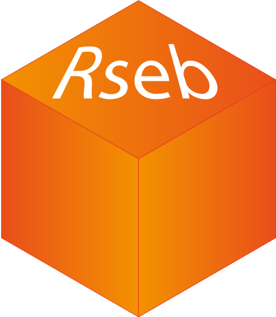

# Rseb 

An R-package for daily tasks necessary to handle biological data as well as avoid re-coding of small functions for quick but necessary data managing.

## Dependencies/Requirements
Some functions of this package require `Bioconductor` libraries. this functions should install automatically the package. Anyway, install `Bioconductor` repository is reccomended. 

```r
if (!requireNamespace("BiocManager", quietly = TRUE))
    install.packages("BiocManager")
BiocManager::install()
```

The possibile required packages are: `Biostrings`, `biomaRt`, `GO.db`, `rtracklayer`.
To install them directly you need to have previously installed `BiocManager` and then:

```r
BiocManager::install(c("Biostrings", "biomaRt", "GO.db", "rtracklayer"))
```

## Installation
```r
# Install devtools from CRAN
install.packages("devtools")

# Or the development version from GitHub:
## install.packages("devtools")
## devtools::install_github("r-lib/devtools")

# Install the Rseb package
devtools::install_github("sebastian-gregoricchio/Rseb")
```

## Documentation
With the package there is available a [manual](https://github.com/sebastian-gregoricchio/Rseb/blob/main/Rseb_0.1.0_manual.pdf) in pdf version.

## Licence
This package is under [GNU-GPL3](https://www.r-project.org/Licenses/GPL-3) licence.
